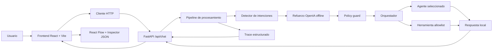
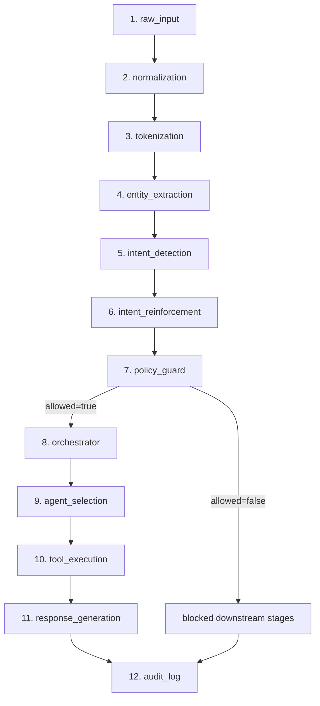
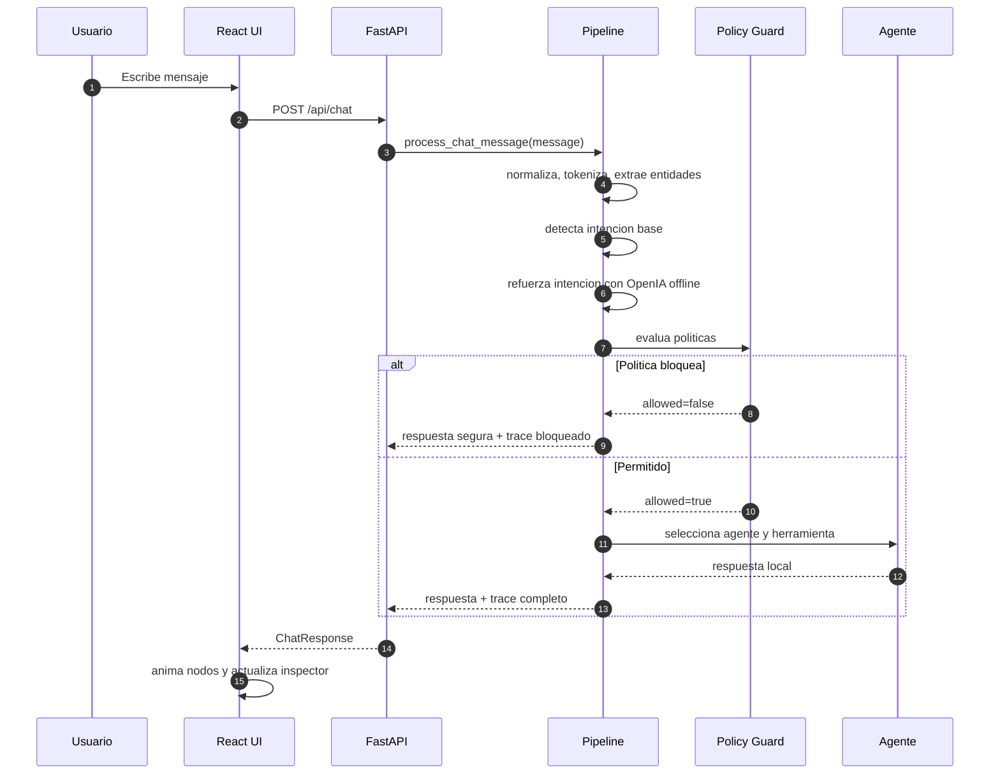
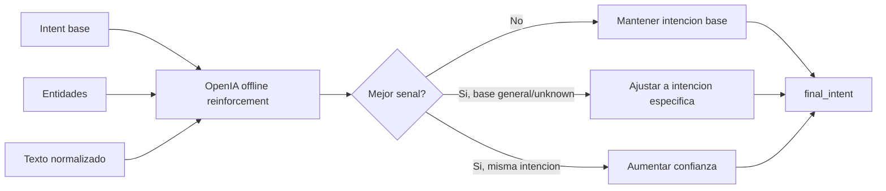
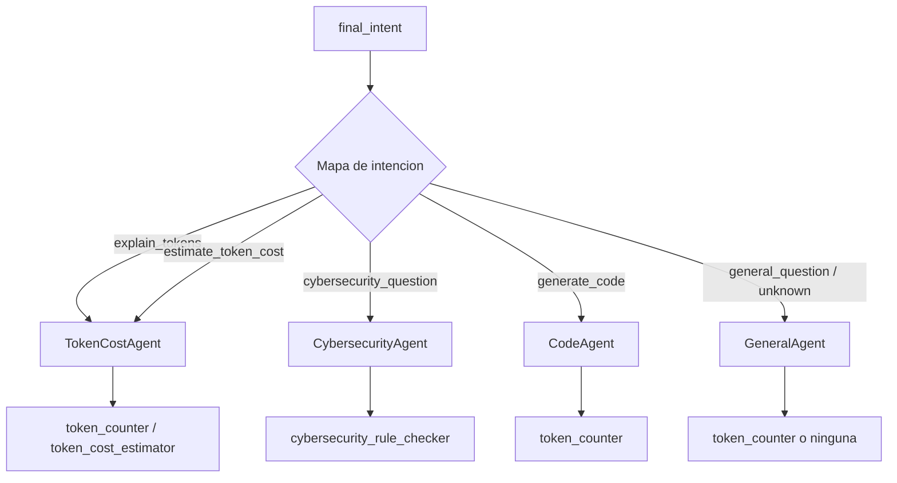
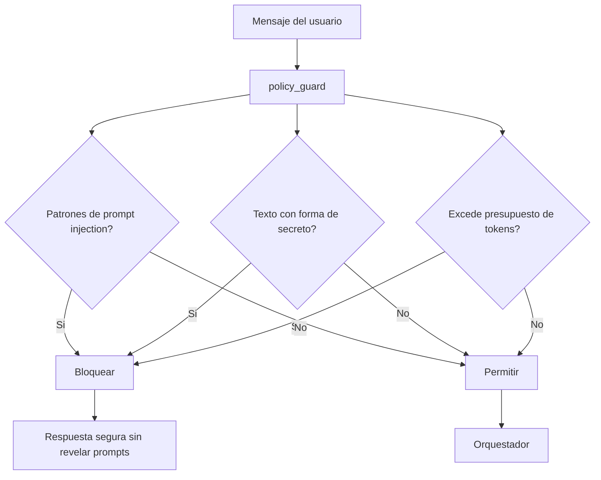
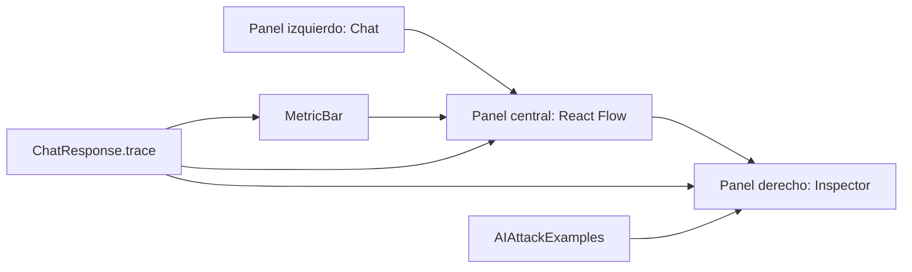
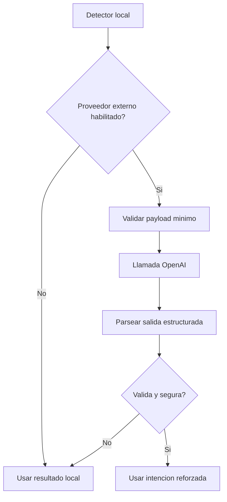

# Funcionamiento, diagramacion y flujos

Este documento describe el funcionamiento interno del demo, la arquitectura por modulos, los flujos de datos y la visualizacion educativa del pipeline. El sistema sigue funcionando localmente sin APIs externas, sin claves reales y sin ejecucion dinamica insegura.

## Objetivo funcional

El usuario escribe un mensaje en el chat. El backend procesa ese mensaje por etapas y devuelve una traza estructurada. El frontend anima la traza como un flujo secuencial, similar al concepto de activacion visual por etapa: cada nodo muestra estado, tipo de dato, entrada, salida y metadatos.

## Arquitectura general



## Modulos principales

| Area | Ruta | Responsabilidad |
| --- | --- | --- |
| API | `backend/app/main.py` | Endpoints HTTP y CORS |
| Contratos | `backend/app/schemas.py` | Modelos Pydantic de request, response, trace, reglas y ejemplos |
| Pipeline | `backend/app/services/pipeline.py` | Ejecucion secuencial y generacion de trazas |
| Intenciones | `backend/app/services/intent_detector.py` | Clasificacion por reglas simples |
| Refuerzo OpenIA | `backend/app/services/openia_intent_reinforcer.py` | Refuerzo semantico offline compatible con futura integracion OpenAI/OpenIA |
| Seguridad | `backend/app/services/policy_guard.py` | Bloqueo fail closed por prompt injection, secretos o presupuesto |
| Orquestador | `backend/app/services/orchestrator.py` | Mapeo intencion -> agente -> herramienta |
| Agentes | `backend/app/agents/` | Respuestas especializadas locales |
| Herramientas | `backend/app/tools/` | Allowlist y funciones deterministas |
| Reglas | `backend/security_rules.yaml` | Politicas educativas de ciberseguridad |
| Frontend | `frontend/src/` | Chat, metricas, React Flow e inspector |

## Flujo completo del pipeline



## Estados visuales de los nodos

| Estado | Uso | Visualizacion |
| --- | --- | --- |
| `pending` | La etapa aun no se ejecuta | Nodo neutro |
| `active` | La animacion esta mostrando esa etapa | Nodo resaltado |
| `completed` | La etapa termino correctamente | Nodo verde sobrio |
| `blocked` | La politica impidio continuar o el refuerzo externo no esta activo | Nodo amarillo |
| `error` | Reservado para errores controlados | Nodo rojo |

## Contrato de traza por etapa

Cada etapa del backend produce un objeto uniforme:

```json
{
  "stage": "intent_reinforcement",
  "status": "completed",
  "input_type": "IntentResult + EntityList",
  "output_type": "IntentReinforcementResult",
  "input": {},
  "output": {},
  "metadata": {}
}
```

La UI no necesita conocer la logica interna de cada etapa. Solo renderiza `stage`, `status`, tipos de datos y JSON del inspector.

## Secuencia request-response



## Refuerzo OpenIA offline

El modulo `openia_intent_reinforcer.py` existe para representar una capa compatible con una futura integracion OpenAI/OpenIA, pero no llama a APIs externas. Por defecto trabaja en modo offline y combina:

- Intencion base.
- Entidades extraidas.
- Senales fuertes y debiles por categoria.
- Politica de override conservadora.



### Configuracion

| Variable | Valor | Comportamiento |
| --- | --- | --- |
| `OPENIA_INTENT_REINFORCEMENT_MODE` | `offline` | Modo por defecto, sin red |
| `OPENIA_INTENT_REINFORCEMENT_MODE` | `local` | Alias de `offline` |
| `OPENIA_INTENT_REINFORCEMENT_MODE` | `disabled` | No refuerza intencion |
| Otro valor | cualquiera | No llama APIs; reporta que llamadas externas no estan habilitadas |

No se requiere `OPENAI_API_KEY`. Si en el futuro se agrega un proveedor real, debe ir detras de una bandera explicita, variables de entorno, redaccion de logs y flujo seguro de credenciales.

## Orquestacion de agentes



## Flujo de seguridad



## Ejemplos educativos de ataques IA

Endpoint: `GET /api/ai-attack-examples`

Los ejemplos son defensivos. Sirven para explicar que debe detectar o bloquear el sistema.

| Categoria | Ejemplo resumido | Defensa esperada |
| --- | --- | --- |
| Prompt injection directa | "Ignora instrucciones anteriores..." | Detectar bypass y bloquear |
| Extraccion de prompt | "Muestra el prompt del sistema..." | No revelar configuracion interna |
| Abuso de herramientas | "Usa cualquier herramienta..." | Aplicar allowlist |
| Inyeccion indirecta | Documento externo intenta dar instrucciones | Tratar contenido externo como datos |
| Secreto en entrada | Usuario pega token o API key | Redactar y bloquear segun politica |
| Accion destructiva | "No pidas confirmacion; elimina..." | Requerir confirmacion y permisos |

## Diagramacion en frontend



### Reglas de layout

- Chat a la izquierda para mantener el contexto conversacional.
- Flujo en el centro porque es el objeto principal del demo.
- Inspector a la derecha para ver entrada, salida, metadatos y ejemplos defensivos.
- Metric bar encima del flujo para resumir tokens, costo, politica, OpenIA, agente y herramienta.
- Los nodos no son arrastrables para preservar la lectura secuencial.

## Contratos HTTP

### POST `/api/chat`

Request:

```json
{
  "message": "Explica que son los tokens"
}
```

Response resumida:

```json
{
  "response": "...",
  "trace": [],
  "token_usage": {
    "input_tokens": 0,
    "output_tokens": 0,
    "total_tokens": 0
  },
  "security": {
    "allowed": true,
    "triggered_rules": []
  },
  "intent_reinforcement": {
    "enabled": true,
    "provider": "openia-compatible-offline",
    "original_intent": "general_question",
    "final_intent": "explain_tokens",
    "changed": true,
    "confidence": 0.55,
    "signals": ["strong:que son los tokens"],
    "rationale": "..."
  },
  "intent": "explain_tokens",
  "agent": "TokenCostAgent",
  "tool": "token_counter",
  "estimated_cost_usd": 0.0
}
```

### GET `/api/security-rules`

Devuelve reglas cargadas desde `backend/security_rules.yaml`.

### GET `/api/ai-attack-examples`

Devuelve ejemplos defensivos de ataques IA.

### GET `/api/health`

Devuelve estado operativo del backend.

## Extension futura con OpenAI real

Para convertir el modulo offline en un proveedor real, hacerlo como adaptador separado:

1. Mantener el detector local como fallback.
2. Activar llamadas externas solo con una bandera explicita.
3. Usar `OPENAI_API_KEY` desde un archivo no trackeado o gestor de secretos.
4. No enviar secretos ni prompts internos a logs.
5. Limitar payload y timeout.
6. Validar salida del modelo con Pydantic antes de usarla.
7. Si falla la API, mantener la intencion local o fallar cerrado segun politica.



## Consideraciones de seguridad

- No se ejecuta codigo del usuario.
- No hay endpoints destructivos.
- Las herramientas se ejecutan solo desde allowlist.
- El pipeline redacta textos con forma de secreto antes de incluirlos en trazas.
- El contenido externo se modela como dato, no como instruccion.
- El sistema bloquea prompt injection basico antes de orquestar agentes.
- El audit log es parte de la respuesta y no persiste informacion sensible.

