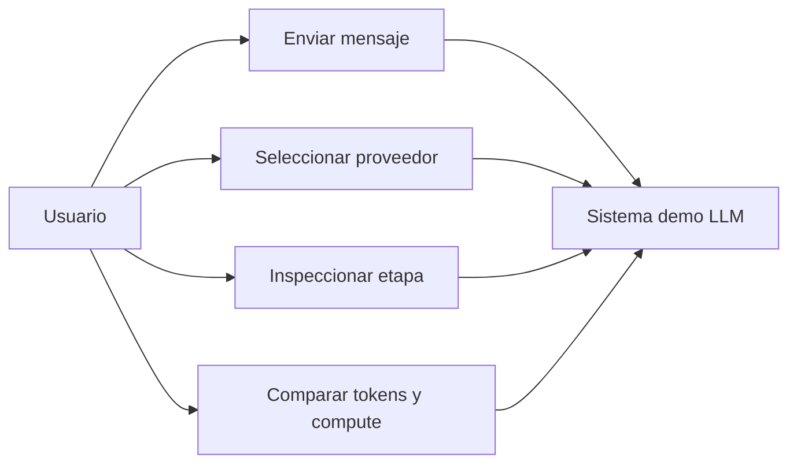
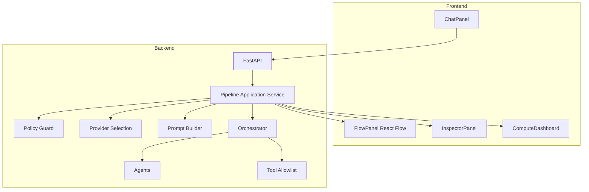
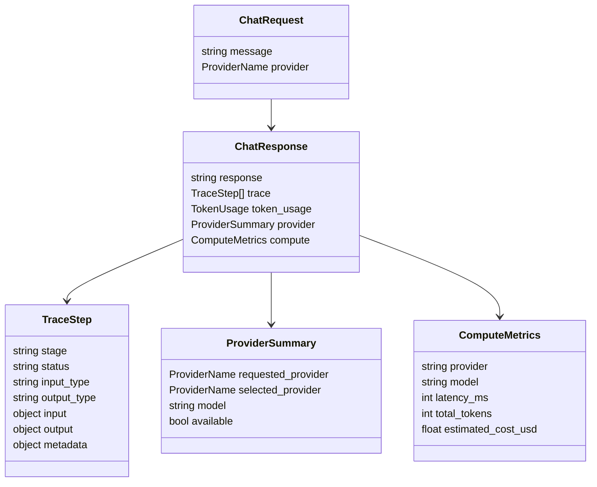
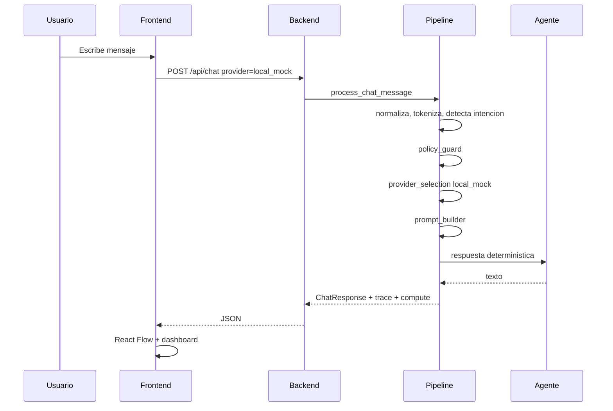
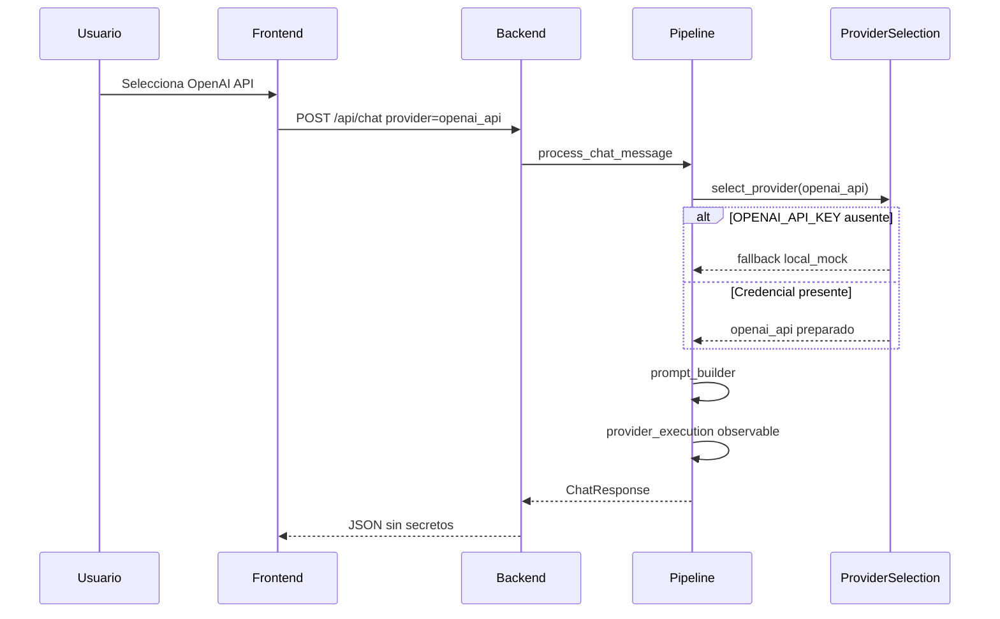
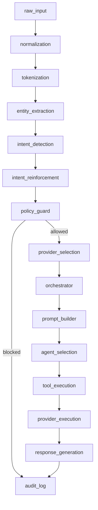
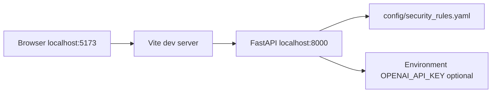

# UML y diagramas Mermaid

## Casos de uso

```mermaid
flowchart LR
  U["Usuario"] --> UC1["Enviar mensaje"]
  U --> UC2["Seleccionar proveedor"]
  U --> UC3["Inspeccionar etapa"]
  U --> UC4["Comparar tokens y compute"]
  UC1 --> S["Sistema demo LLM"]
  UC2 --> S
  UC3 --> S
  UC4 --> S
```

## Componentes

```mermaid
flowchart TB
  subgraph Frontend
    Chat["ChatPanel"]
    Flow["FlowPanel React Flow"]
    Inspector["InspectorPanel"]
    Compute["ComputeDashboard"]
  end
  subgraph Backend
    API["FastAPI"]
    Pipeline["Pipeline Application Service"]
    Policy["Policy Guard"]
    Provider["Provider Selection"]
    Prompt["Prompt Builder"]
    Orch["Orchestrator"]
    Agents["Agents"]
    Tools["Tool Allowlist"]
  end
  Chat --> API
  API --> Pipeline
  Pipeline --> Policy
  Pipeline --> Provider
  Pipeline --> Prompt
  Pipeline --> Orch
  Orch --> Agents
  Orch --> Tools
  Pipeline --> Flow
  Pipeline --> Inspector
  Pipeline --> Compute
```

## Clases principales

```mermaid
classDiagram
  class ChatRequest {
    string message
    ProviderName provider
  }
  class ChatResponse {
    string response
    TraceStep[] trace
    TokenUsage token_usage
    ProviderSummary provider
    ComputeMetrics compute
  }
  class TraceStep {
    string stage
    string status
    string input_type
    string output_type
    object input
    object output
    object metadata
  }
  class ProviderSummary {
    ProviderName requested_provider
    ProviderName selected_provider
    string model
    bool available
  }
  class ComputeMetrics {
    string provider
    string model
    int latency_ms
    int total_tokens
    float estimated_cost_usd
  }
  ChatRequest --> ChatResponse
  ChatResponse --> TraceStep
  ChatResponse --> ProviderSummary
  ChatResponse --> ComputeMetrics
```

## Secuencia modo local

```mermaid
sequenceDiagram
  participant U as Usuario
  participant F as Frontend
  participant B as Backend
  participant P as Pipeline
  participant A as Agente
  U->>F: Escribe mensaje
  F->>B: POST /api/chat provider=local_mock
  B->>P: process_chat_message
  P->>P: normaliza, tokeniza, detecta intencion
  P->>P: policy_guard
  P->>P: provider_selection local_mock
  P->>P: prompt_builder
  P->>A: respuesta deterministica
  A-->>P: texto
  P-->>B: ChatResponse + trace + compute
  B-->>F: JSON
  F->>F: React Flow + dashboard
```

## Secuencia OpenAI API preparada

```mermaid
sequenceDiagram
  participant U as Usuario
  participant F as Frontend
  participant B as Backend
  participant P as Pipeline
  participant PS as ProviderSelection
  U->>F: Selecciona OpenAI API
  F->>B: POST /api/chat provider=openai_api
  B->>P: process_chat_message
  P->>PS: select_provider(openai_api)
  alt OPENAI_API_KEY ausente
    PS-->>P: fallback local_mock
  else Credencial presente
    PS-->>P: openai_api preparado
  end
  P->>P: prompt_builder
  P->>P: provider_execution observable
  P-->>B: ChatResponse
  B-->>F: JSON sin secretos
```

## Actividad del pipeline

```mermaid
flowchart TD
  A["raw_input"] --> B["normalization"]
  B --> C["tokenization"]
  C --> D["entity_extraction"]
  D --> E["intent_detection"]
  E --> F["intent_reinforcement"]
  F --> G["policy_guard"]
  G -->|blocked| Z["audit_log"]
  G -->|allowed| H["provider_selection"]
  H --> I["orchestrator"]
  I --> J["prompt_builder"]
  J --> K["agent_selection"]
  K --> L["tool_execution"]
  L --> M["provider_execution"]
  M --> N["response_generation"]
  N --> Z
```

## Despliegue local

```mermaid
flowchart LR
  Browser["Browser localhost:5173"] --> Vite["Vite dev server"]
  Vite --> API["FastAPI localhost:8000"]
  API --> Config["config/security_rules.yaml"]
  API --> Env["Environment OPENAI_API_KEY optional"]
```

